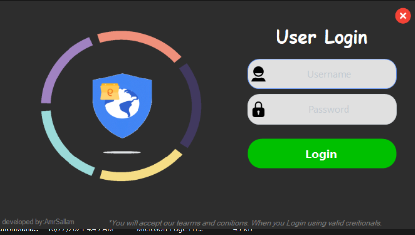
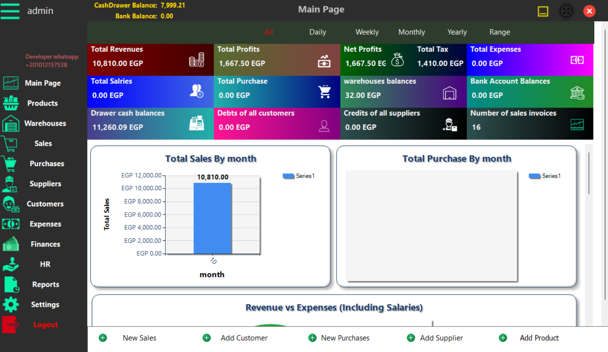
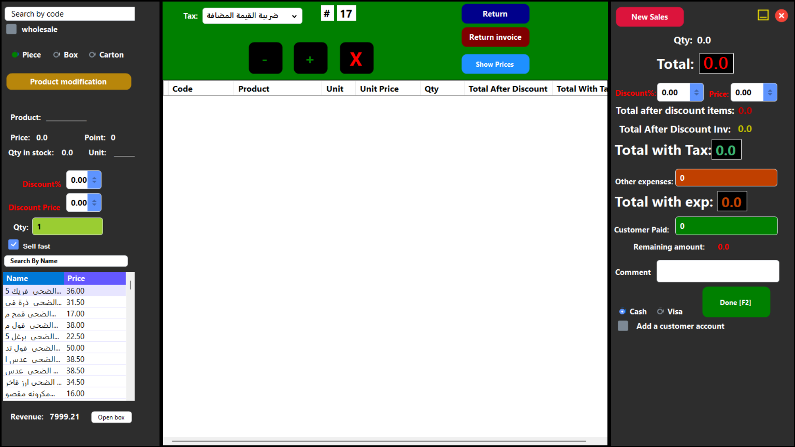
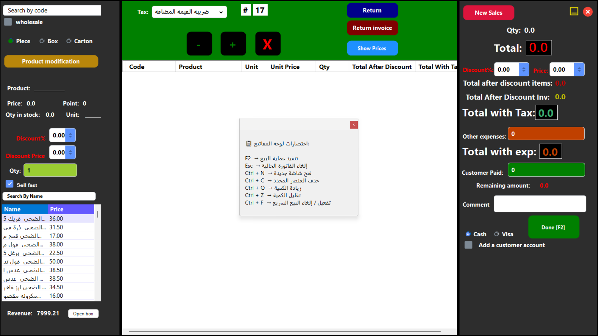
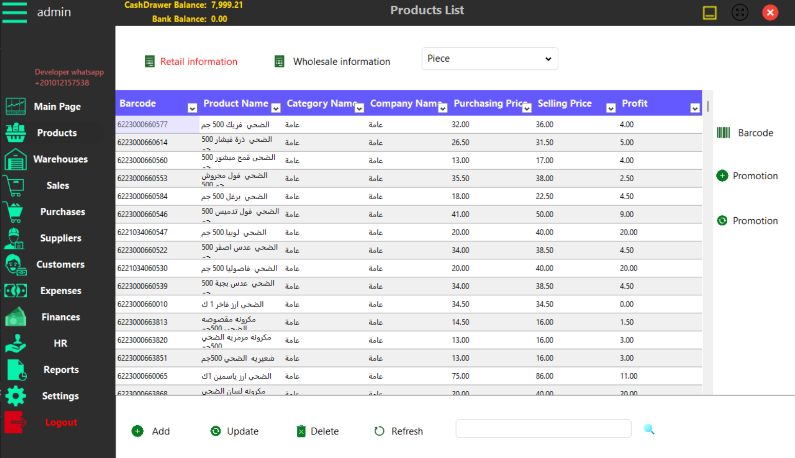
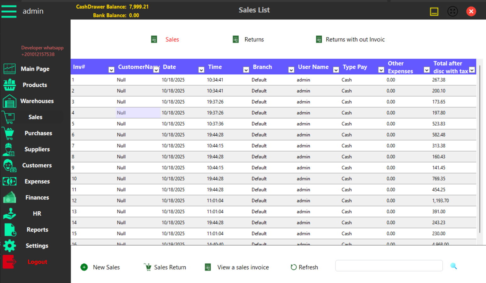
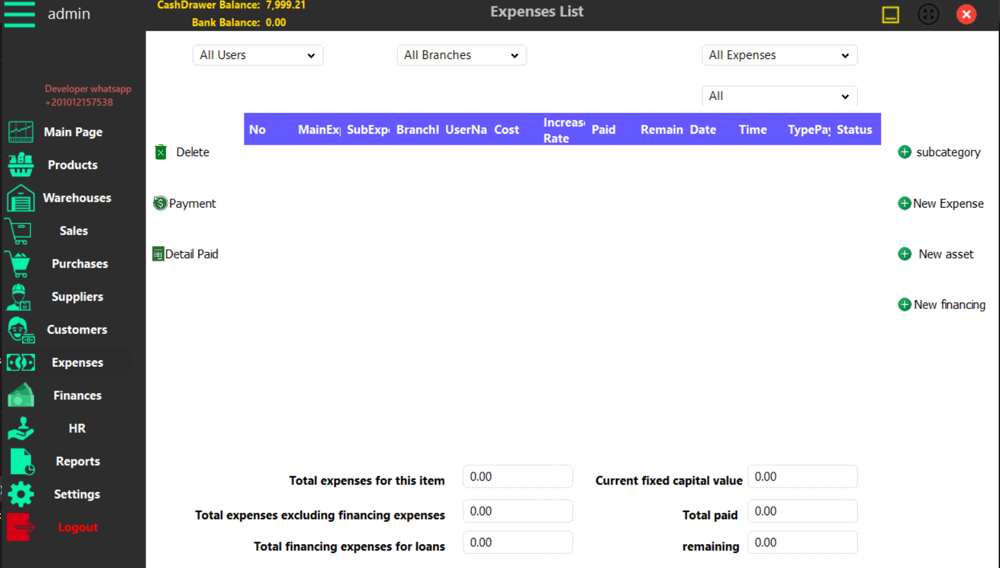
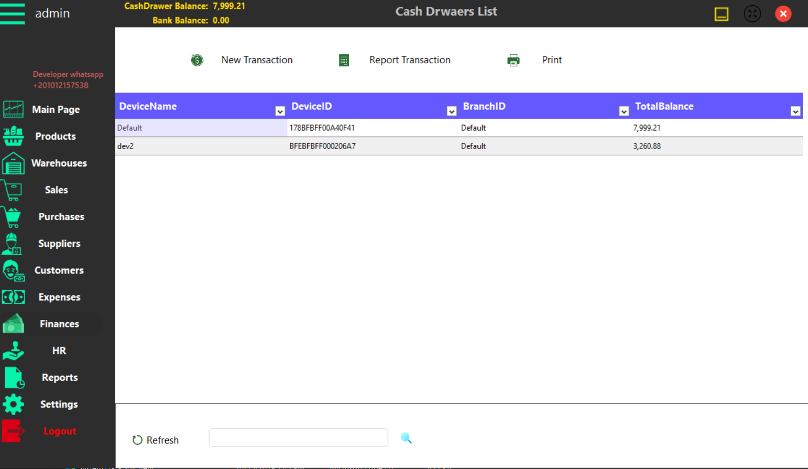
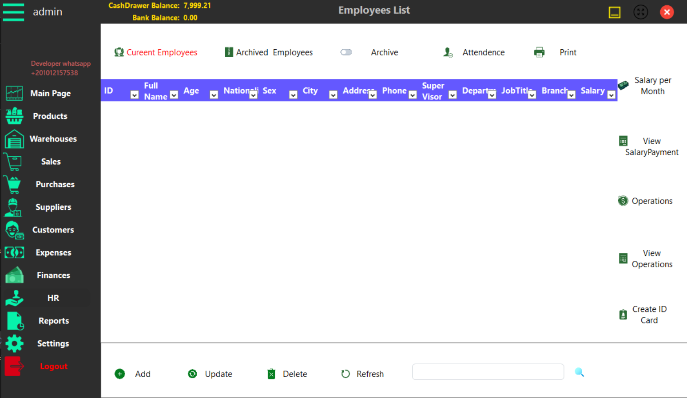
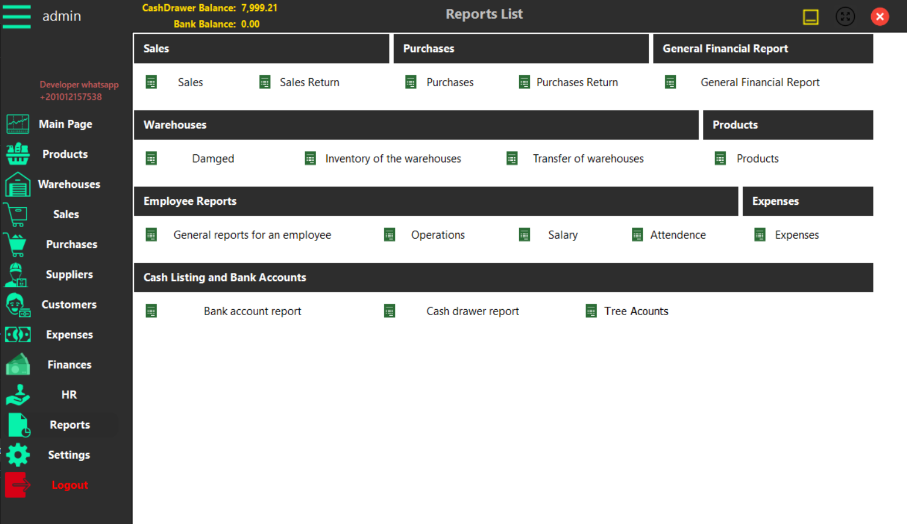

# 🏪 **Complete Business Management System**

## 📋 **System Overview**
A professional business management system developed using **C# WinForms, RDLC Reports, and Local Database**. Manages all business operations: **Sales, Purchasing, Inventory, Accounting, and HR**. Works **100% offline** and supports **Windows 7 and above**.

---

## ✅ **No SQL Server Required!**
The system uses **Local Database (LocalDB)** which:
- ✅ **Automatically installs** with the system
- ✅ **No separate SQL Server installation needed**
- ✅ **Works on any Windows computer**
- ✅ **No database administration required**
- ✅ **Simple file-based database**

---
## Screenshots











## ⭐ **Core Features**

### **1️⃣ Sales & Returns**
- **Retail & Wholesale** sales
- **Returns with invoice** (full tracking)
- **Returns without invoice** (manual processing)
- **Price quotes** system
- **Automatic promotions** (percentage discounts)

### **2️⃣ Purchasing**
- **Purchase orders** to suppliers
- **Goods receiving**
- **Supplier returns**
- **Supplier payments**

### **3️⃣ Inventory Management**
- **Multi-unit system**: Piece ← Box ← Carton
- **Stock transfers** between warehouses
- **Damage & waste** tracking
- **Stock shortage** alerts
- **Barcode support** (weight & price)

### **4️⃣ Accounting**
- **Expense management**
- **Financial reports**
- **Chart of accounts**
- **Customer/supplier accounts**

### **5️⃣ HR & Payroll**
- **Salary records**
- **Attendance tracking**
- **Department management**
- **Employee archive**

---

## 🚀 **Quick Installation**

### **Step-by-Step Setup:**
```bash
1. Download the ZIP file
2. Extract to any folder (e.g., C:\BusinessSystem\)
3. Run Setup.exe
4. Wait for automatic installation (2-3 minutes)
5. Run BusinessSystem.exe from desktop shortcut
```

### **First-Time Login:**
```
Username: admin
Password: admin
```
*Change password immediately after first login*

---

## 📁 **System Structure**

```
BusinessSystem/
├── 📄 BusinessSystem.exe      (Main program)
├── 📁 Database/               (Local database - auto managed)
├── 📁 Reports/                (All report templates)
├── 📁 Templates/              (Invoice & receipt templates)
├── 📁 Backup/                 (Auto backup location)
└── 📄 UserGuide.pdf           (Complete user manual)
```

---

## 🔧 **Initial Configuration**

### **1. Company Setup:**
```
Menu: Settings → Company Information
• Enter company name, address, phone
• Upload logo (optional)
• Set tax information
• Configure invoice numbering
```

### **2. Warehouse Setup:**
```
Menu: Inventory → Warehouses
• Add main warehouse
• Add additional warehouses if needed
• Set default warehouse for sales
```

### **3. Products Setup:**
```
Menu: Inventory → Products
• Add product categories
• Add products with barcodes
• Set retail and wholesale prices
• Configure units: piece/box/carton
```

### **4. User Accounts:**
```
Menu: Administration → Users
• Create accounts for employees
• Set permissions (admin/cashier/store)
• Configure attendance tracking
```

---

## 💰 **Sales Operations**

### **Retail Sale:**
```bash
1. Click "New Sale"
2. Scan barcode or search product
3. Enter quantity (pieces)
4. Apply discounts if any
5. Select payment method
6. Print receipt
```

### **Wholesale Sale:**
```bash
1. Click "Wholesale Sale"
2. Select customer (optional)
3. Add products by box/carton
4. Apply wholesale pricing
5. Generate invoice
6. Print delivery note
```

### **Returns Processing:**

**With Invoice:**
```bash
1. Enter invoice number
2. Select items to return
3. Choose refund/exchange
4. Print return receipt
```

**Without Invoice:**
```bash
1. Search product manually
2. Manager approval required
3. Select return type
4. Update inventory
```

---

## 📦 **Inventory Management**

### **Multi-Unit System:**
```
Example: Tomato Paste
┌──────────┬─────────────┬────────────┐
│ Unit     │ Quantity    │ Price      │
├──────────┼─────────────┼────────────┤
│ Piece    │ 1           │ $1.00      │
│ Box      │ 24 pieces   │ $20.00     │
│ Carton   │ 12 boxes    │ $220.00    │
└──────────┴─────────────┴────────────┘
```

### **Stock Operations:**
1. **Receive Stock** (from purchases)
2. **Issue Stock** (for sales)
3. **Transfer Stock** (warehouse to warehouse)
4. **Adjust Stock** (corrections)
5. **Damage/Waste** recording

---

## 🖨️ **Printing Setup**

### **Supported Printers:**
1. **Thermal Receipt Printer** (58mm/80mm)
2. **A4 Laser Printer** (for invoices)
3. **Barcode Label Printer** (optional)

### **Configuration:**
```
Menu: Settings → Printer Setup
1. Select receipt printer
2. Select invoice printer
3. Test printing
4. Save settings
```

---

## 💾 **Backup & Security**

### **Automatic Backup:**
- Daily backup at system close
- Location: `C:\BusinessSystem\Backup\`
- Keeps last 30 days backups

### **Manual Backup:**
```
Menu: File → Backup
1. Choose backup location
2. Click "Backup Now"
3. Store backup file safely
```

### **Restore:**
```
Menu: File → Restore
1. Select backup file
2. Confirm restore
3. System restarts
```

---

## 📊 **Reports Available**

### **Daily Reports:**
1. **Daily Sales Summary**
2. **Cashier Report**
3. **Stock Movement**
4. **Attendance Report**

### **Financial Reports:**
1. **Profit & Loss**
2. **Expense Summary**
3. **Customer Balance**
4. **Supplier Balance**
5. **Financial Summary**


### **Inventory Reports:**
1. **Stock Status**
2. **Low Stock Alert**
4. **Damage Report**

---

## ❓ **FAQ**

**Q: Does it need internet?**  
**A: ❌ No, works 100% offline.**

**Q: Windows 7 support?**  
**A: ✅ Yes, Windows 7 and above.**

**Q: SQL Server needed?**  
**A: ❌ No, built-in LocalDB included.**

**Q: Multiple computers?**  
**A: ✅ Yes, network version available.**

**Q: Free trial?**  
**A: ✅ Yes, 30-day full-feature trial.**

---

## 🔧 **Troubleshooting**

### **Common Issues:**

1. **Program won't start:**
   - Install .NET Framework 4.8
   - Restart computer


2. **Printer issues:**
   - Test from Windows
   - Reconfigure printer

### **Support:**
```
Email: amr74513@gmail.com
Phone: +20 10 12 15 7538
Hours: 9 AM - 5 PM (Egypt Time)
```

---

## 📝 **System Requirements**

### **Minimum:**
- Windows 7 SP1 or later
- 2GB RAM
- 5GB free space
- Any printer

### **Recommended:**
- Windows 10/11
- 4GB RAM
- 10GB free space
- Thermal printer for receipts

---

## ⚠️ **Important Notes**

1. **Test first** with sample data
2. **Train staff** before going live
3. **Daily backups** are essential
4. **Keep receipts** for returns
5. **Update regularly** when available

---

**Version: 1.5.0 | Release Date: 2025 | Developer: Amr Sallam**

---


**🎯 Ready to Use - Simple Setup - No Technical Skills Needed**
